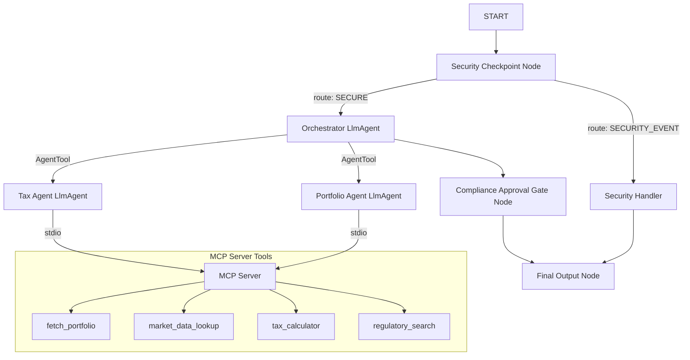

# Submission Write-Up: fin-tax-concierge

## Problem Statement

Navigating financial tracking and tax compliance is complex, especially within the Indian regulatory system. Taxpayers frequently face challenges:
1.  **Estimations & Mathematical Hallucinations:** Traditional LLMs struggle with calculations and often hallucinate tax liabilities.
2.  **Changing Holding Period Guidelines:** Indian tax regulations (updated in July 2024) have different rules for Short-Term vs. Long-Term classification based on the asset type (e.g., 12 months for listed equity, 24 months for gold/property), which LLMs struggle to evaluate accurately without deterministic logic.
3.  **Advance Tax Deadlines:** Keeping track of dynamic tax schedules and installments is difficult, leading to late fees and compliance failures.

`fin-tax-concierge` addresses these problems by marrying natural language comprehension with a deterministic calculation and compliance engine.

---

## Solution Architecture

The solution uses a graph-based workflow that enforces data security at entry, orchestrates dedicated agents to handle specific domains, and leverages a local Model Context Protocol (MCP) server to ensure calculations are mathematically correct and compliance rules are deterministically applied.

---

## Concepts Used & File References

*   **ADK Workflow Graph:** The application is built using the ADK 2.0 graph API to control security routing, delegation, human confirmation, and formatting ([app/agent.py](file:///e:/adk-workspace/fin-tax-concierge/app/agent.py)).
*   **LlmAgent:** Implemented three distinct agents (`orchestrator`, `portfolio_agent`, and `tax_agent`) with customized system instructions ([app/agent.py:L39-106](file:///e:/adk-workspace/fin-tax-concierge/app/agent.py#L39-L106)).
*   **AgentTool:** Employed `AgentTool` to wrap `portfolio_agent` and `tax_agent` as callable functions for the orchestrator, enabling modular delegation ([app/agent.py:L104](file:///e:/adk-workspace/fin-tax-concierge/app/agent.py#L104)).
*   **MCP Server:** Implemented a custom stdio Model Context Protocol server exposing four tools for portfolio lookup, current pricing, tax calculations, and compliance rules ([app/mcp_server.py](file:///e:/adk-workspace/fin-tax-concierge/app/mcp_server.py)).
*   **Security Checkpoint:** A function node executing regex-based PII scrubbing (PAN/Aadhaar) and prompt-injection detection, producing structured audit logs ([app/agent.py:L113-176](file:///e:/adk-workspace/fin-tax-concierge/app/agent.py#L113-L176)).
*   **Agents CLI:** Project scaffolded, updated, and validated using `agents-cli` ([pyproject.toml](file:///e:/adk-workspace/fin-tax-concierge/pyproject.toml) and [Makefile](file:///e:/adk-workspace/fin-tax-concierge/Makefile)).

---

## Security Design

1.  **PII Scrubbing:** Detects Indian PAN cards (`[A-Z]{5}[0-9]{4}[A-Z]`) and Aadhaar cards (`[0-9]{4}\s?[0-9]{4}\s?[0-9]{4}`) to redact them before requests reach the core LLMs, protecting sensitive user identities.
2.  **Prompt Injection Shield:** Evaluates incoming text for common override patterns (e.g., `"ignore previous instructions"`) and routes them immediately to a handler that bypasses LLMs, preventing system hijack.
3.  **Structured Auditing:** Outputs JSON audit logs for every query showing security parameters (PII found, injection found, severity level), providing full visibility.
4.  **Transaction Gate (Consent Rule):** Intercepts trade modification or bulk selling intents to pause execution until explicit consent is given.

---

## MCP Server Design

*   `fetch_portfolio(user_id: str)`: Deterministically retrieves the transaction history and holdings from a structured database.
*   `market_data_lookup(symbol: str)`: Looks up asset class classification and current prices, preventing the LLM from hallucinating prices.
*   `tax_calculator(transactions: list[dict])`: Performs deterministic Indian capital gains calculations. It checks dates, computes holding periods, maps them to asset types (12-month limit for listed equities, 24-month for other assets), and applies the exact STCG (20%) or LTCG (12.5%) rates post Union Budget 2024.
*   `regulatory_search(query: str)`: Returns structured regulatory guidelines and advance tax schedules (June 15, Sept 15, Dec 15, March 15), ensuring up-to-date compliance information.

---

## Human-in-the-Loop (HITL) Flow

*   **Trigger:** Triggered when the security checkpoint flags a request containing transaction modification keywords (e.g., `"sell all"`, `"simulate transaction"`, `"log sale"`).
*   **Mechanism:** The `compliance_approval_gate` yields a `RequestInput` card pausing execution and asking the user: `"Compliance Approval Required: Do you authorize this action?"`.
*   **Outcome:** If the user confirms with `"yes"`, the workflow resumes and processes the request. If `"no"`, it aborts, protecting the user's portfolio from accidental or unauthorized changes.

---

## Demo Walkthrough

1.  **Test Case 1 (Portfolio Lookup):** Verifies that the `orchestrator` delegates to the `portfolio_agent` and invokes `fetch_portfolio` to render a clean view of user holdings.
2.  **Test Case 2 (Tax Calculation):** Verifies that holding period checks and calculations are offloaded to `tax_calculator`, generating a reliable capital gains breakdown.
3.  **Test Case 3 (Prompt Injection):** Verifies that malicious prompts are rejected at the security node and routed directly to the error handler.

---

## Impact / Value Statement

`fin-tax-concierge` provides significant value to retail investors in India:
*   **Accuracy:** Offloading math to the MCP server ensures 100% accurate tax estimates, eliminating costly LLM calculation errors.
*   **Compliance:** Adapts dynamically to the post-July 2024 rules (Budget 2024), guiding users through complex asset classifications and upcoming advance tax deadlines.
*   **Security:** Safeguards investor portfolios from data leaks and prompt manipulation, providing institutional-grade trust.
